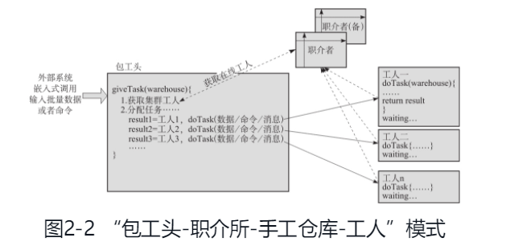

## 《大规模分布式系统架构与设计实战》

### 2.1 分布式并行计算模式
#### 2.1.1 最初想到的master-slave结构
#### 2.1.2 “包工头-职介所-手工仓库-工人”模式

各个角色：
- 包工头：Contractor
    - 负责分配和调度：讲任务拆分给各个工人，同时不限制各个工人产出的中间结果所存放的位置，一般是工人所处的本地
    - 是一个并行计算应用的程序入口，它不是一个服务程序，运行完成就退出
- 工人：MigrantWorker
    - 相当于一个计算节点，可以部署在多台机器
    - 按照包工头的指令，从“输入仓库”获取资源，加工后再放入“输出仓库”，然后通知包工头
- 职介所：ParkServer
    - 包工头和工人之间的沟通桥梁，可部署在一台独立的机器
    - 工人加入集群时，先到职介所登记；包工头需要用人时到职介所去获取工人
    - 与工人保持松散的联系，联系的频率自定，但不能断了联系
- 手工仓库：WareHouse
    - 输入输出，是对所需要计算的资源的抽象。可以存放任意对象，是一个map的实现
> WareHouse doTask（WareHouse inhouse）这样的接口设计，它的输入输出都是WareHouse，意味着它可以接受任意数量、任意类型的输入，也可以返回任意数量、任意类型的输出，这样能做到最大灵活程度，因为作为一个框架，我们无法假定开发用户设计出什么样的输入输出参数，以及什么样的类型

总结：
- 包工头负责分配任务，开发者实现分配任务接口。
- 农民工负责执行任务，开发者实现任务执行接口。
- 职介所负责协同一致性等处理（登记，介绍，保持联系）。
- 手工仓库负责输入输出数据交换。

